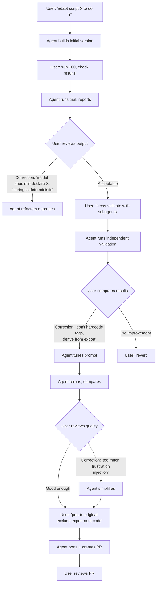

# Sierra Skill Gap Audit — Sky Project

## Corpus Note

Of 8 sessions in the Cursor Sky workspace (April 3+), **only 2 contained Sierra work**. The other 6 were DataCamp course automation sessions that happened to share the workspace. No other tool (Codex, Claude Code, OpenCode) had Sky-project Sierra sessions in scope. All findings below derive from these 2 sessions:

| UUID | Date | Lines | Topic |
|---|---|---|---|
| `adf67198` | Apr 7 11:51 | 5 | `pnpm sierra sync-content` bug debugging |
| `5d04dec5` | Apr 10 12:31 | 426 | Transcript-to-simulation generator pipeline |

Confidence levels are constrained: no finding achieves "high confidence" (2+ agents, independent sessions). One cross-agent finding reaches medium confidence. All others are single-session.

---

## 1. Executive Summary

The two Sierra sessions reveal one major undocumented workflow (transcript-to-simulation generation) and one undocumented CLI layer (`pnpm sierra` content management commands). The existing skills are well-structured for their covered domain — manual sim authoring, `sierras` CLI operations, and replay debugging — but have a blind spot for programmatic sim generation pipelines and the `pnpm sierra` commands that support them. The highest-signal gaps are design principles the user had to teach mid-session: never hardcode Studio-managed taxonomy into prompts, use deterministic filtering over model-declared classification, and auto-refresh `content-export.json` before any pipeline that depends on it. These are not edge cases; they are foundational rules for any agent that helps build Sierra automation scripts.

---

## 2. Per-Focus Findings

### Focus 1: Repeated Setup Instructions

**Finding count**: 1

**F1.1 — Content-export freshness as implicit precondition**

The user enforces that `content-export.json` must be current before any pipeline runs, and eventually makes the agent build auto-refresh into the script itself.

> "great. now let's add just one more thing and make the script run the content export command so that it ensure latest data by design"
> — Session `5d04dec5`, ~turn 84

**Confidence**: Single session (`5d04dec5`)

**Gap assessment**: Partially covered in `sierra-best-practices` — the "Journey context is mandatory" constraint implies data freshness, but there is no explicit rule that *scripts or pipelines reading intent metadata must auto-refresh `content-export.json` first*. The user had to teach this twice in the same session: once when the agent hardcoded stale tag rules (turn ~42), and again when requesting the auto-export feature (turn ~84).

---

### Focus 2: Mid-Session Corrections and Frustration

**Finding count**: 4

**F2.1 — Deterministic filtering vs. model-declared classification**

The agent built fields asking the LLM to declare whether a transcript is an immediate transfer. The user corrected: the model infers the best tag, filtering is deterministic code.

> "as far as i understand, the model doesnt need to declare whether it's an immediate transfer or not. it just infers the necessary tag, and filtering out is deterministic"
> — Session `5d04dec5`, ~turn 25

**Confidence**: Single session (`5d04dec5`)

**Gap assessment**: Not in any skill. This is a pipeline design principle: *classification is the model's job; exclusion/filtering is deterministic code applied after classification against the current source of truth*.

**F2.2 — No hardcoded tag-specific rules in LLM prompts**

The agent proposed adding tag-specific tie-breaker rules to the classification prompt. The user rejected immediately.

> "actual tags can change in studio at any point. i prefer not to tie the prompt to any specifics. are we passing to the prompt the actual intent description?"
> — Session `5d04dec5`, ~turn 42

**Confidence**: Single session (`5d04dec5`)

**Gap assessment**: Not in any skill. `sierra-best-practices` says "Sierra libraries are private" and "retrieval over generation" but never states the corollary: *never hardcode Studio-managed taxonomy (tags, intents, categories) into code or prompts; always derive dynamically from the current export*.

**F2.3 — Don't blanket-inject behavioral modifiers in generated sims**

The user noticed generated sims were over-applying frustration instructions to every scenario.

> "i think we're also ending up asking user to show high frustration level in every single generated sim. that doesn't sound right"
> — Session `5d04dec5`, ~turn 65

**Confidence**: Single session (`5d04dec5`)

**Gap assessment**: Partially covered in `simulations.md` — validity checklist mentions "Reasonable turn count" and staying on-topic, but nothing addresses *generated sim instruction quality*. The principle: *behavioral modifiers (frustration, transfer demands) should be conditionally injected based on evidence from the source material, not blanket-applied*.

**F2.4 — Lean minimal over over-engineered sim instructions**

After the agent proposed an elaborate conditional system for transfer demands, the user cut through it.

> "let's remove the tranfer request altogether. i don't feel like it's adding much"
> — Session `5d04dec5`, ~turn 76

**Confidence**: Single session (`5d04dec5`)

**Gap assessment**: Not in any skill. Principle: *when generating sims from transcripts, favor minimal faithful reproduction of the source scenario over injecting artificial behaviors*.

---

### Focus 3: Implicit Domain Knowledge

**Finding count**: 3

**F3.1 — `pnpm sierra` as a parallel CLI entry point**

The user ran `pnpm sierra sync-content default` in the `agents/triage` directory — a CLI entry point distinct from the documented `sierras` CLI.

> (Agent describing what the user showed): "The user is showing me a terminal error from running `pnpm sierra sync-content default` in the `agents/triage` directory."
> — Session `adf67198`, turn 2

The agent also discovered `export-content` as a workaround:
> "**Workaround**: `sierra export-content` calls the same `saveRemoteContentToLocal` but with `overwrite: true`, which skips `getPatch` entirely"
> — Session `adf67198`, turn 6

**Confidence**: Medium (corroborated across both sessions — Agent 1 found `sync-content`/`export-content` in `adf67198`; Agent 2 found `content-export.json` auto-refresh via `pnpm sierra` in `5d04dec5`)

**Gap assessment**: Not in `sierra-powertool`. The skill documents only the `sierras` CLI. `sierra-best-practices` mentions `pnpm sierra watch` once in Debug Notes but not `sync-content`, `export-content`, or any content management commands.

**F3.2 — `content-export.json` + `automatic-escalations.tsx` + `SWALLOW_MAP` relationship**

The user directed the agent through a complex data relationship: `content-export.json` defines intents and `transferImmediately` flags; `automatic-escalations.tsx` contains `SWALLOW_MAP` defining overlap exclusions between broad immediate-transfer intents and narrower non-immediate ones.

> "does it attempt to identify or remove conversations where the resulting intent would be an immeidate transfer? if not, how would we do that?"
> — Session `5d04dec5`, ~turn 8

The agent needed multiple turns (turns 8-12) to trace this through the codebase.

**Confidence**: Single session (`5d04dec5`)

**Gap assessment**: Not in any skill. This is undocumented architectural knowledge about how the triage agent's intent taxonomy works and how content exports relate to automatic escalation rules.

**F3.3 — Generic ranking rules over tag-specific rules for classification prompts**

The user transmitted a design preference: LLM prompts classifying against a taxonomy should use generic decision policies (prefer narrow over broad, prefer explicit ask over resolution path) rather than tag-specific if-then rules.

> "actual tags can change in studio at any point. i prefer not to tie the prompt to any specifics"
> — Session `5d04dec5`, ~turn 42

The accepted prompt used only generic rules like "Choose the single best primaryAppTag" and "If an appTag description includes 'This does NOT apply when:', treat that as a real exclusion."

**Confidence**: Single session (`5d04dec5`)

**Gap assessment**: Not in any skill. `simulations.md` covers sim instruction design, not LLM prompt design for classification pipelines.

---

### Focus 4: Undocumented Workflow Sequences

**Finding count**: 2

**F4.1 — Transcript-to-simulation generation pipeline**

Session `5d04dec5` follows a complete multi-phase workflow:

1. Duplicate original script (don't modify in-place for experiments)
2. Add intent metadata loading from `content-export.json`
3. Run trial with small count (100) to validate
4. Cross-validate with independent sub-agents
5. Compare agreement rates programmatically
6. Prompt-tune based on disagreement patterns
7. Rerun and compare — revert if no improvement
8. Full production run (1000x)
9. Quality review generated output
10. Port changes to original script (excluding experiment-specific code)
11. Regenerate from cache
12. PR creation and review

Key quotes:
> "let's first go for a run of max 100 conversations that get through this step and check the result"
> — Session `5d04dec5`, ~turn 18

> "let's fire a set of subagents to semantically parse those same conversations and try and infer the main intent on their own. once they finish, cross reference their results vs those of the script"
> — Session `5d04dec5`, ~turn 32

> "it's ok to revert then"
> — Session `5d04dec5`, ~turn 49

> "ok, now let's add the script changes to the original file, do not merge codex proxy related code"
> — Session `5d04dec5`, ~turn 61

**Confidence**: Single session (`5d04dec5`)

**Gap assessment**: Not in any skill. Neither `sierra-powertool` nor `sierra-best-practices` nor `simulations.md` document transcript-to-sim generation. `simulations.md` is entirely focused on manually-authored sim instructions.

**F4.2 — Content sync as a development workflow step**

The user ran `sync-content` against the default workspace as a routine step. The agent discovered this is part of a broader content-management workflow (sync for incremental updates, export for full overwrites).

> "`export-content` calls the same `saveRemoteContentToLocal` but with `overwrite: true`, which skips `getPatch` entirely"
> — Session `adf67198`, turn 6

**Confidence**: Single session (`adf67198`)

**Gap assessment**: Not in any skill.

---

### Focus 5: Output and Tracking Conventions

**Finding count**: 1

**F5.1 — Versioned cache files and comparison artifacts for pipeline work**

Session `5d04dec5` established conventions for:
- Cache files at `scripts/.transcript-analysis-cache.codex-proxy.primary-app-tag.json`
- Audit files at `scripts/.transcript-immediate-transfer-audit.codex-proxy.json`
- Comparison artifacts in `/tmp/triage-transcript-intent-crosscheck-<date>/` with `manifest.json`, batched transcripts, `script-results.json`, `comparison.json`, `prompt-v2-diff.json`

**Confidence**: Single session (`5d04dec5`)

**Gap assessment**: Not in any skill. `sierra-powertool` documents `sim bench query` output conventions but not pipeline-generated artifacts.

---

### Focus 6: Analysis-to-Implementation Boundary

**Finding count**: 2

**F6.1 — Terse confirmation phrases signal implementation approval**

The user consistently uses short affirmative phrases to transition from analysis to action:
- "let's add this, yeah" (~turn 11)
- "yeah, let's do this" (~turn 25)
- "yeah, let's add this and re-run the 100x run, see how it changes" (~turn 43)
- "lets go" (~turn 206)
- "yeah, lets fix everything" (~turn 208)

And uses explicit scoping to constrain:
> "ok, now let's add the script changes to the original file, do not merge codex proxy related code"
> — Session `5d04dec5`, ~turn 61

**Confidence**: Single session (`5d04dec5`)

**Gap assessment**: Partially covered in `sierra-powertool` ("Analysis and implementation are separate scopes"). The existing rule correctly says "don't auto-implement," but doesn't cover the reverse direction: how to recognize scoped approval signals or handle "implement X but not Y" boundaries.

**F6.2 — Agent correctly respected the boundary in CLI debugging**

In session `adf67198`, the agent diagnosed a bug and offered both a workaround and a patch path, but did NOT start implementing. This aligns with the existing skill rule.

**Confidence**: Single session (`adf67198`)

**Gap assessment**: Already covered in `sierra-powertool` Interaction Rules. No gap.

---

### Focus 7: Recurring Session Arcs

**Finding count**: 1 arc identified. Cross-session recurrence cannot be confirmed from 2 sessions — this arc needs validation against future sessions.

**F7.1 — "Build-Trial-Validate-Refine-Ship" arc for transcript-based pipeline work**

**Arc shape**: Starts with a script adaptation request. Evolves through trial runs with progressive corrections to the agent's design assumptions (3 distinct correction cycles in this session). Ends with selective porting of changes and PR.

**Sessions**: Only observed in `5d04dec5`. The CLI debugging session (`adf67198`) is too short (5 lines) to exhibit an arc.

**Front-loadable instructions that would have collapsed the teaching phase**:
1. "Classification is the model's job; filtering/exclusion is deterministic code against current `content-export.json`" — would have saved ~5 turns (turns 24-52 of `5d04dec5`)
2. "Never hardcode Studio-managed taxonomy into prompts; derive all tag/intent references dynamically from the export" — would have saved ~3 turns (turns 82-86)
3. "Generated sim instructions should faithfully reflect the source transcript's scenario, not blanket-inject behavioral modifiers like frustration or transfer demands" — would have saved ~4 turns (turns 127-152)

**Estimated savings**: ~12 turns of back-and-forth if a "Transcript Sim Generation Principles" skill section existed.

---

## 3. Skill Mapping Table

| # | Finding | Target Skill | Target Section | Priority | Draft Wording |
|---|---------|-------------|----------------|----------|---------------|
| F3.1 | `pnpm sierra` content management CLI | `sierra-powertool` | New section: "Content Management Commands" | **P1** | `pnpm sierra sync-content <workspace>` — incremental content sync from remote. `pnpm sierra export-content <workspace>` — full overwrite from remote (skips patch diffing). Run from the agent's project directory (`agents/<bot-name>/`). Use `export-content` when `sync-content` fails on patch conflicts. |
| F2.2 | No hardcoded Studio taxonomy | `sierra-best-practices` | Anti-Patterns table | **P1** | New row: Temptation: "Hardcode tag names, intent categories, or group labels into scripts or LLM prompts." Reality: "Studio-managed taxonomy changes without notice. Always derive from the current `content-export.json`. Use generic classification policies (prefer narrow over broad) rather than tag-specific rules." |
| F2.1 | Deterministic filtering principle | `simulations.md` | New section: "Pipeline Design" (or new skill) | **P2** | "When building pipelines that generate or classify simulations: classification is the model's job (infer the best tag from the taxonomy); exclusion and filtering are deterministic code applied after classification against `content-export.json`. Do not ask the model to declare membership in a filter category." |
| F1.1 | Auto-refresh content-export | `sierra-best-practices` | Constraints | **P2** | New bullet: "**Content export freshness.** Any script or pipeline that reads intent metadata from `content-export.json` must auto-refresh the export before running. Stale exports cause classification drift and false exclusions." |
| F4.1 | Transcript-to-sim pipeline workflow | New skill or `simulations.md` addendum | New section: "Programmatic Sim Generation" | **P2** | Workflow: (1) duplicate script for experiments, (2) load intent metadata from fresh `content-export.json`, (3) trial run at small scale (100), (4) cross-validate with independent agents, (5) compare agreement rates, (6) prompt-tune on disagreements, (7) revert if no improvement, (8) production run, (9) quality review (check for blanket behavioral injection, duplicates), (10) port to original excluding experiment code, (11) PR. |
| F2.3 | No blanket behavioral injection | `simulations.md` | Validity or new "Generated Sim Quality" section | **P2** | "Generated sim instructions should faithfully reproduce the source scenario. Do not blanket-apply behavioral modifiers (frustration, transfer demands, escalation requests) unless the source transcript evidences them. Each modifier must be traceable to source material." |
| F3.2 | Content export architecture | `sierra-best-practices` | References | **P3** | New reference entry: "Content export architecture: `content-export.json` defines intents and `transferImmediately` flags. `automatic-escalations.tsx` contains `SWALLOW_MAP` defining overlap exclusions between broad immediate-transfer intents and narrower non-immediate ones. Both must be consulted when filtering transcripts by intent type." |
| F6.1 | Scoped implementation signals | `sierra-powertool` | Interaction Rules | **P3** | Extend "Analysis and implementation are separate scopes" with: "When the user approves implementation, watch for scoping constraints ('add X but not Y', 'port changes excluding Z'). Implement only what's approved. If the scope is ambiguous, ask." |
| F5.1 | Pipeline artifact conventions | `sierra-powertool` or new skill | New section | **P3** | "Pipeline scripts should write versioned cache files (`.transcript-analysis-cache.<variant>.json`), audit logs (`.transcript-*-audit.<variant>.json`), and cross-validation artifacts to `/tmp/<project>-<task>-<date>/`." |

---

## 4. Decision Points

### Extend existing vs. new skill

**Extend existing** (recommended for now):
- `sierra-powertool`: Add content management commands (F3.1) and scoped implementation signals (F6.1)
- `sierra-best-practices`: Add anti-pattern for hardcoded taxonomy (F2.2), content export freshness constraint (F1.1), and architecture reference (F3.2)
- `simulations.md`: Add pipeline design principles (F2.1, F2.3) and generated sim quality rules

**New skill candidate**: "Transcript Sim Generation" — if future sessions confirm this is a recurring workflow, the pipeline workflow (F4.1), artifact conventions (F5.1), and generation-specific design principles (F2.1-F2.4) would be better served by a dedicated skill rather than scattered across existing files.

**Recommendation**: Start by extending existing skills (P1 and P2 items). If the transcript-to-sim pipeline recurs in future sessions, extract it into a dedicated skill.

### What to deprioritize

- **F5.1 (pipeline artifact conventions)**: Low confidence, single session, and the naming conventions may be project-specific rather than universal. Wait for recurrence.
- **F3.2 (content export architecture)**: This is Sky/triage-specific domain knowledge. Adding it to `sierra-best-practices` (which applies to all Sierra agents) may be too narrow. Consider a per-agent reference doc instead.
- **Terminal-reference-as-prompt pattern** (Agent 1, F1 area): This is a Cursor convention, not a Sierra skill gap. Skip.

---

## 5. Limitations and Next Steps

**This audit is severely corpus-limited.** 6 of 8 sessions in the Sky workspace were DataCamp automation, leaving only 2 Sierra sessions (1 short debugging session, 1 long pipeline session). The findings are directionally useful but cannot be called "recurring patterns" with confidence.

**Recommended follow-ups:**
1. **Expand scope to butea + toolkit workspaces** — the original plan identified 9 Cursor butea sessions, 6 Claude Code butea sessions, 12 toolkit sessions, and 5 Codex sessions from April 3+. These likely contain denser Sierra content (butea is the `sierras` CLI codebase, toolkit contains the skills themselves).
2. **Re-run with content pre-filter** — grep for `sierra`/`sierras`/`sim`/`journey`/`workspace` before assigning sessions to agents, to avoid wasting agent capacity on off-topic sessions.
3. **Validate F4.1 (transcript-to-sim pipeline)** as a recurring arc — if it appears in butea or toolkit sessions, it becomes a high-confidence finding warranting its own skill.
